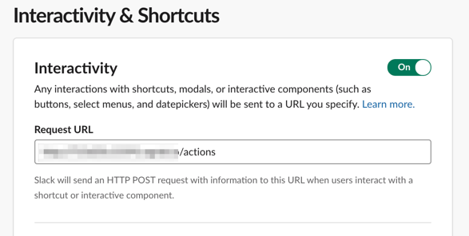
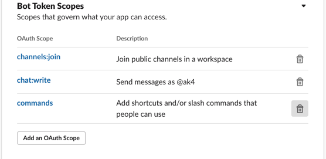

ak4-slack
====

## TL;DR

- Slackからslash commandでAKASHIに打刻するためのAPI

## Demo

## Deploy

### SlackApp

- slash commandsの設定
  - slash commandを追加する
  

  - request urlを設定する(パスは`/slash`)
  

- interactivity
  - interactivity & shortcutsを設定する（パスは`/actions`）
  

- permissionsを追加
  - `chat:write`, `channels:join`（打刻の通知先を設定しない場合は不要）を追加する
  

### Deploy to Heroku

- Heroku Schedulerに以下のjobを追加する
  - `curl https://[your-app-name].herokuapp.com/`（Frequency: Every 10 minutes）
  - `python refresh_user_tokens.py`（Frequency: Daily at 6:00 PM UTC）

## Environment Veriables

- AKASHI_COMPANY_ID
- SLACK_BOT_TOKEN
- SLACK_SIGNING_SECRET
- DATABASE_URL
- SLACK_CHANNEL_ID(optional)

## Requirements

- Python3.9+
- Pipenv

## Development

### Installation

- `pipenv install --dev`

### Pipenv scripts

- `pipenv run start`
  run local server
- `pipenv run sort`
  run isort
- `pipenv run test-cov`
  run tests

## License

[MIT](LICENSE)
